<p align="center">

</p>

# 基于Qt框架（C++）和SQLite数据库的学生信息管理系统

## 项目简介：

这个项目是基于**Qt框架（C++）**和**SQLite**轻量级数据库开发的**GUI**学生信息管理系统，系统集成了学生基本信息管理、成绩记录、班级管理、课表查看等功能。

## 技术栈

- **前端界面**：Qt框架（C++）

  - Qt Widgets：用于构建丰富的桌面应用程序界面。
  - Qt SQL模块：用于数据库操作，简化数据库访问和管理。

- **后端数据库**：SQLite

  - 轻量级数据库引擎，无需单独安装，易于部署。
  - 支持SQL标准，适合小型到中型应用。

  

## 操作说明

### 一.登录界面：

<p align="center">
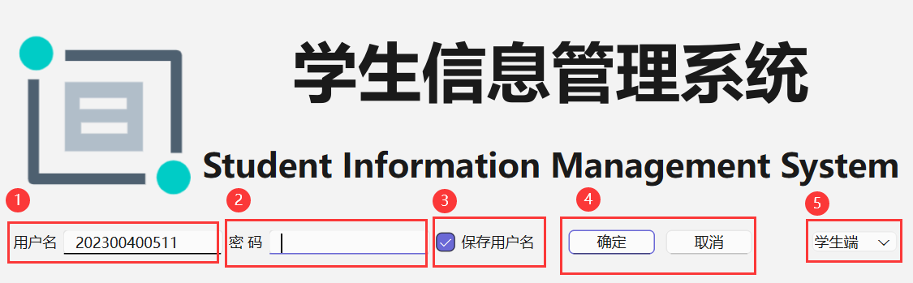
</p>

1. 输入用户名，学生端用户名为学生的学号，管理员端用户名为"sdu"。

2. 输入密码，密码默认为"12345678"，登录后可以自行更改密码，密码保存在数据库中，为经过MD5加密以后的字符串。

3. 保存用户名，是否保存用户名，如果点击保存，则程序会把用户名存入注册表中，下一次登录时将自动填入上一次保存的用户名。

   （注册表路径：计算机\HKEY_CURRENT_USER\Software\SMS\studentManagementSystem    Windows中在终端用"regedit"指令查看注册表）

4. 点击进入或退出系统。

5. 切换学生端和管理员端。

### 二.学生端（管理员端）界面：

<p align="center">
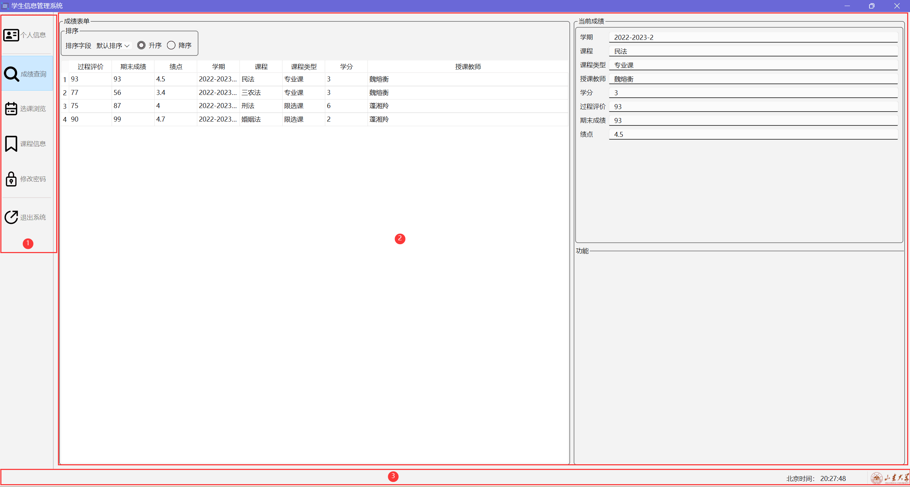
</p>

1. 工具栏，可以按住上方拖动条拖动，使之横向显示，点击工具栏上的每个选项切换至相应界面，每个选项也设置有快捷键（自上往下依次为Ctrl+1到Ctrl+5），可以用快捷键快速切换界面，鼠标悬停在选项上显示提示信息，点击退出系统时会询问是否退出。
2. 功能界面，相应功能实现的组件。
3. 状态栏，左下角会显示相应的提示信息，右下角会显示当前系统时间和山东大学的校徽。
4. 管理员端与学生端架构相似。

### 三.功能界面：

#### 学生端：

* 个人信息：

  <p align="center">
  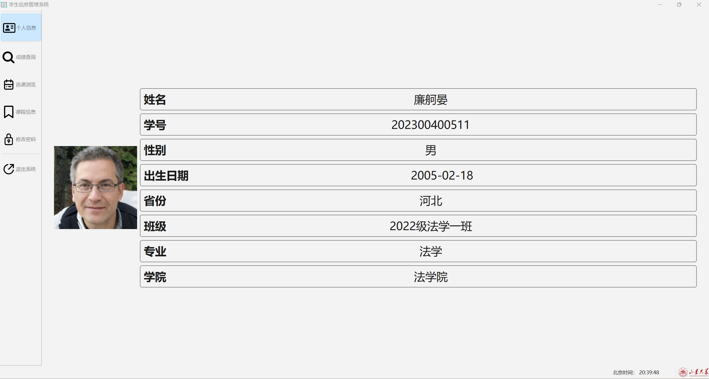
  </p>显示学生的详细个人信息

* 成绩查询：

  <p align="center">
  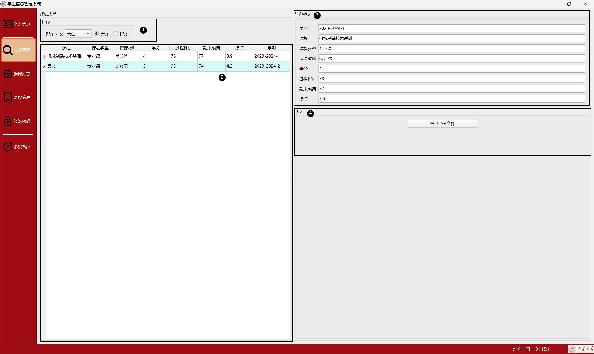
  </p>

  1. 可以选择用于排序的字段，包括升降序。
  2. 显示成绩表单。
  3. 显示当前选中的详细成绩表单。
  4. 一键导出CSV文件，可以用Excel表格查看

* 选课浏览：

  <p align="center">
  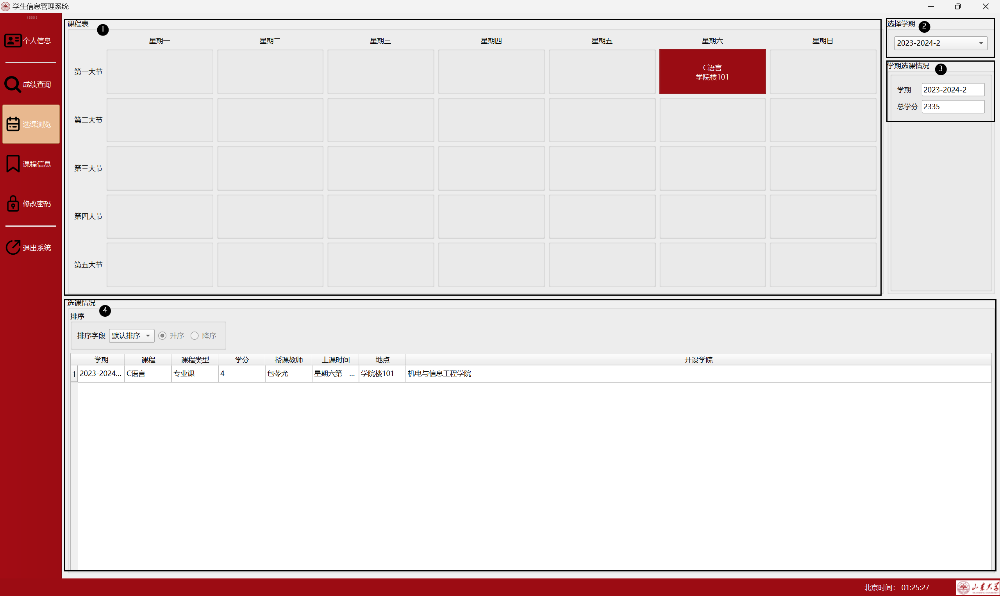
  </p>

  1. 可以查看当前学期课表，包括课程名和地点。
  2. 选择查看的学期。
  3. 显示当前学期与总学分。
  4. 显示课程表单。

* 课程信息：

  <p align="center">
  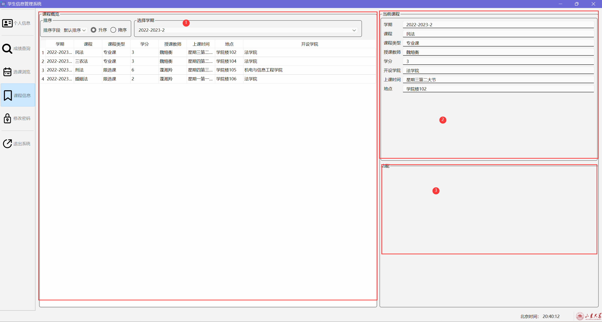
  </p>

  1. 显示课程信息表，支持分学期查看。
  2. 显示当前课程的详细信息。
  3. 一键导出CSV文件，可以用Excel表格查看

* 修改密码：

  <p align="center">
  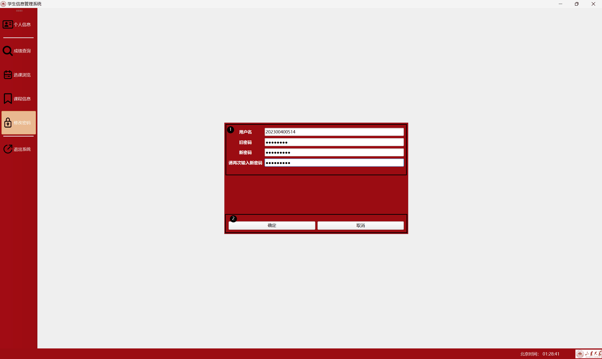
  </p>

1. 输入旧密码和两次新密码，要求密码格式为8-16位的由数字和字母组成的字符串，不能包含特殊字符。
2. 确定或者取消更改密码。

#### 管理员端：

* 学生管理：

  <p align="center">
  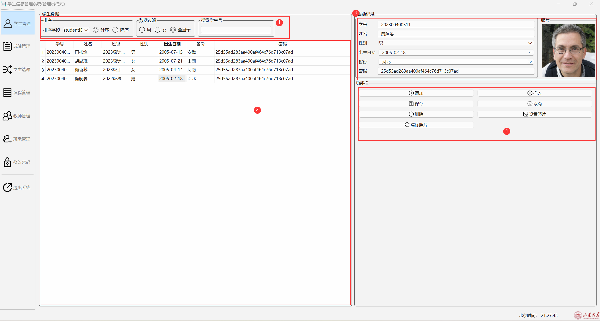
  </p>

1. 可以设置排序字段(字段名为数据库中的真实字段名)，可以分男女，也可以通过学生号搜索。
2. 数据列表，可以修改数据内容。
3. 显示当前选中的记录，可以用来修改数据。
4. 功能栏：
   * 添加：在列表尾添加一条记录。
   * 插入：在选中列表记录位置插入一条记录。
   * 保存：保存当前所有修改。
   * 取消：取消当前所有修改。
   * 删除：删除选中的记录。
   * 设置照片：为选择的记录选择一张照片（从目录中）。
   * 清除照片：清除当前记录的照片。

5. 输入要求：
   * 学号：12位正值整数，如202300400506。
   * 姓名：不超过10个字符且不包含特殊字符的字符串。
   * 班级：在数据列表中选择现有班级(在数据库中为外键classID指向class表主键)。
   * 性别：男或女。
   * 出生日期：输入yyyy-mm-dd格式的日期。
   * 省份：选择相应省份。
   * 密码：默认为"12345678"经过MD5加密过的字符串，管理员可以改变相关学生的密码(经过MD5加密的格式)。

**下面的几个管理界面与组件排布上与学生管理界面相似，只介绍输入要求。**

* 成绩管理：

  <p align="center">
  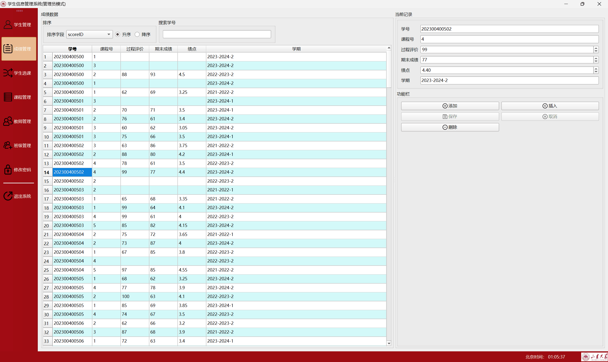
  </p>

  输入要求：

  * 学号：12位正值整数，如202300400506。
  * 课程号：课程的唯一标识号，可以在**课程管理**界面查看。
  * 过程评价、期末成绩：0~100分的正值整数。
  * 绩点：0~5.0的正值小数。
  * 学期：yyyy-yyyy-x格式的字符串(学期信息保存在数据库的setting表中，可以查看和添加)。

* 学生选课：

  <p align="center">
  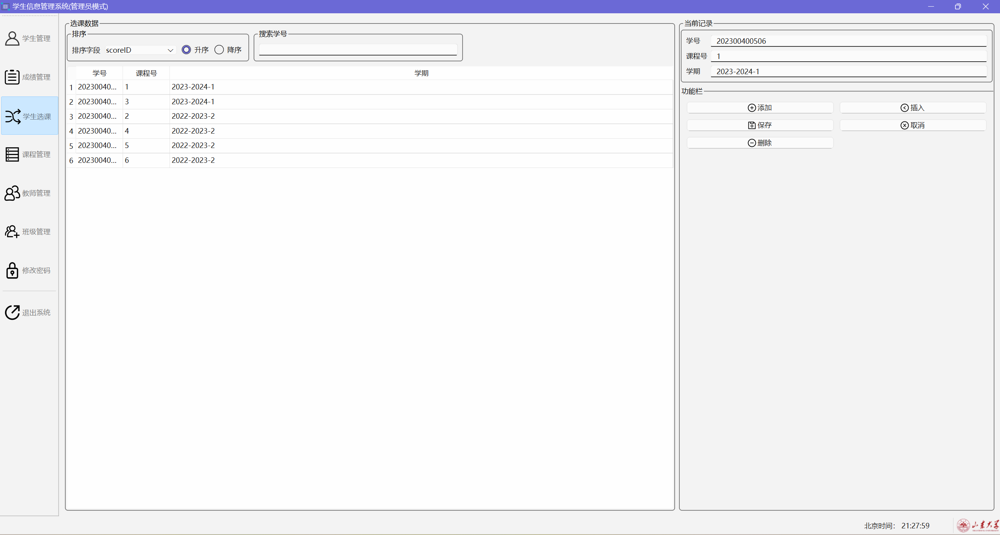
  </p>

  输入要求：

  * 学号：12位正值整数，如202300400506。
  * 课程号：课程的唯一标识号，可以在**课程管理**界面查看。
  * 学期：yyyy-yyyy-x格式的字符串(学期信息保存在数据库的setting表中，可以查看和添加)。

* 课程管理：

  <p align="center">
  
  </p>

  输入要求：

  * 课程号：课程的唯一标识号，可以在**课程管理**界面查看。
  * 课程：课程的名称，不超过20个字符。
  * 课程类型：专业课、限选课和公共课。
  * 学分：课程的学分数，正值整数。
  * 课程时间：格式为星期X第X大节，如果一周有多节课则用空格间隔。
  * 地点：课程授课地点。
  * 教师：在数据列表中选择现有教师(在数据库中为外键teacherID指向teacher表主键)。
  * 学院：在数据列表中选择现有学院(在数据库中为外键schoolID指向school表主键)。

* 教师管理：

  <p align="center">
  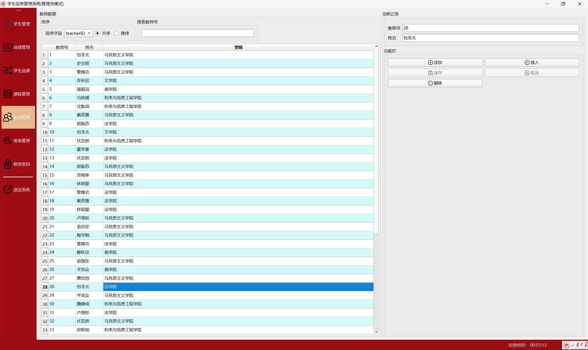
  </p>

  输入要求：

  * 教师号：教师的唯一标识号。
  * 姓名：教师的姓名，不超过10个字符。
  * 学院：在数据列表中选择现有学院(在数据库中为外键schoolID指向school表主键)。

* 班级管理：

  <p align="center">
  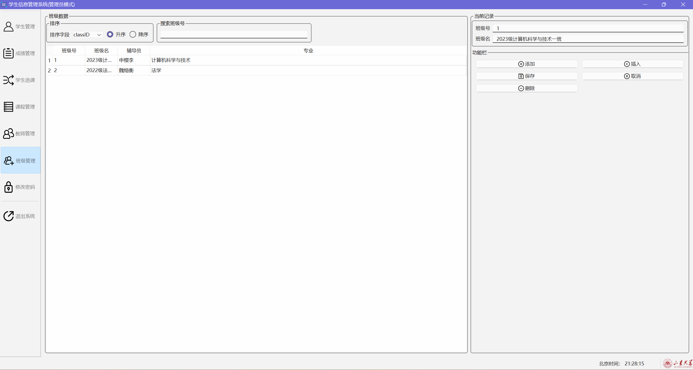
  </p>

  输入要求：

  * 班级号：班级的唯一标识号。
  * 班级名：班级的姓名，不超过20个字符。
  * 辅导员：在数据列表中选择现有教师(在数据库中为外键teacherID指向teacher表主键)。
  * 专业：在数据列表中选择现有专业(在数据库中为外键majorID指向major表主键)。

* 修改密码：与学生端相似，只是不需要输入用户名，略。

## 数据库架构

### 一.数据库模块(smsDatabase类)：

定义在smsdatabase.h和smsdatabase.cpp文件里，会在main.cpp中新建一个全局所有组件所共用的数据库接口(QSqlDatabase)，会通过各自组件的构造函数传递smsDatabase类的指针给其他组件,模块会自动管理SQLite数据库接口的开启和关闭。

### 二.流程图：

```flow
st=>start: 程序启动
e=>end: 程序关闭
setGDB=>operation: 创建一个smsDatabase对象，创建数据库接口
login=>operation: smsDatabase对象删除，关闭数据库接口
sub=>subroutine: 传递给各组件(构造函数)

st->setGDB->sub->login->e

```

### 三.数据库组成(students.db3文件)：

使用SQLite搭建的数据库，具体内容如下：

* student表：储存学生数据。

  <p align="center">
  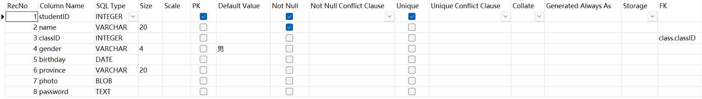
  </p>

* teacher表：储存教师数据。

  <p align="center">
  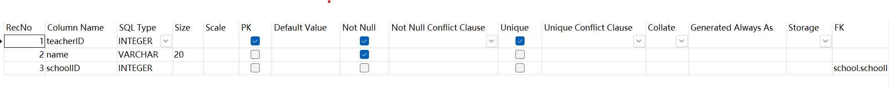
  </p>

* course表：储存课程数据。

  <p align="center">
  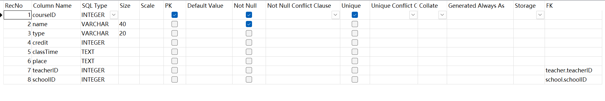
  </p>

* score表：有两个用途：如果学生有相关课程的成绩记录，则说明学生选择了这门课程，而课程是否有过程评价、期末成绩和绩点记录则表示课程是否结课。

  <p align="center">
  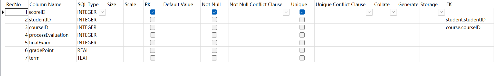
  </p>

* school表：储存学院数据。

  <p align="center">
  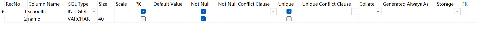
  </p>

* major表：储存专业数据。

  <p align="center">
  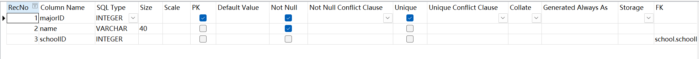
  </p>

* class表：储存班级数据。

  <p align="center">
  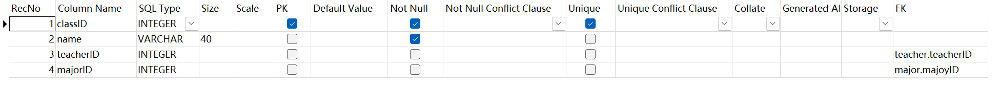
  </p>

* setting表：储存设置信息，包括管理员用户名、密码和学期信息等。

  <p align="center">
  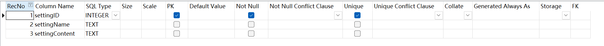
  </p>

## 开发环境与依赖

- **操作系统**：Windows
- **开发环境**：Qt Creator
- **编译器**：MinGW/g++/clang++
- **数据库**：SQLite
